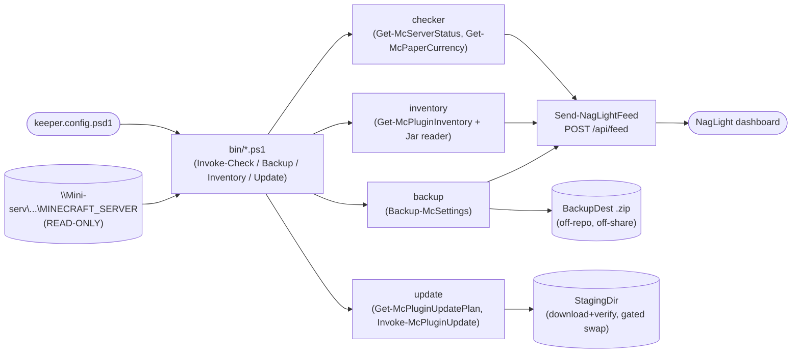

# Architecture (one page)

Owned by the **Software Engineer** hat. MinecraftKeeper is a PowerShell 7 module
(`src/MinecraftKeeper`) plus thin entry-point scripts (`bin/`). The module keeps
a small, testable core; the entry points wire config + reporting around it.

## High-level flow

Read paths treat the server share as **read-only**. The only write to the live
server is the plugin jar swap in `Invoke-McPluginUpdate`, which is dry-run by
default and gated behind `-Execute` (backup-first + rollback). Backups are
written to a configured destination, never into the repo or back onto the share.

## Runtime flows (authored at G2)

Deferred to G2 (the repo is at G1). The load-bearing async concern to document
then is the checker's report-on-failure path: every enabled check must POST to
NagLight even when it throws, so a dead check reads stale, never silent-green.

## Module responsibilities

| Module | Responsibility | Key public items |
|---|---|---|
| `Public/Import-KeeperConfig.ps1` | Load `.psd1` config; override token from env; validate. | `Import-KeeperConfig` |
| `Public/Send-NagLightFeed.ps1` | POST `{check,ok,note}` to `/api/feed`; `-WhatIfPost` dry-run; never fabricates ok=true. | `Send-NagLightFeed` |
| `Public/Get-McServerStatus.ps1` | TCP up-probe (+ optional local process). | `Get-McServerStatus` |
| `Public/Get-McPaperCurrency.ps1` | Installed-vs-latest Paper build via PaperMC v3 fill API. | `Get-McPaperCurrency` |
| `Public/Invoke-McKeeperCheck.ps1` | Checker orchestrator; runs probes and reports each. | `Invoke-McKeeperCheck` |
| `Public/Get-McPluginInventory.ps1` | Enumerate plugins; map to fork/canonical/unmapped; emit redacted JSON+MD. | `Get-McPluginInventory` |
| `Public/Get-McPluginUpdatePlan.ps1` | Latest-compatible lookup (Modrinth) → update plan. | `Get-McPluginUpdatePlan` |
| `Public/Invoke-McPluginUpdate.ps1` | Stage, verify (hash/manifest/api), gated swap + rollback. | `Invoke-McPluginUpdate`, `Test-ApiVersionCompatible` |
| `Public/Backup-McSettings.ps1` | Timestamped settings archive; worlds behind a flag. | `Backup-McSettings` |
| `Public/Get-McForkStatus.ps1` | Per-fork release/tag detection for the fork-fix rung. | `Get-McForkStatus` |
| `Private/Jar.ps1` | Read `plugin.yml` from a jar (zip) read-only. | `Get-PluginManifest` |
| `Private/Log.ps1` | Timestamped console logger. | `Write-KeeperLog` |

Design rules: shared logic lives once (config, feed, jar reader are single
homes); pure comparison logic (version currency, api-version compatibility) is
separated from I/O so it is unit-testable; entry points stay thin.

## Module dependencies (generated)

The kit's `gen_arch_map.py` parses Python only, so the generated map/diagram
below stay empty for this PowerShell repo. The hand-written module table above
is the source of truth; a PowerShell arch-map port (`gen_arch_map.ps1`) is a
deferred nicety recorded in `docs/status.md` — not wired into the G1 gate.

<!-- BEGIN GENERATED DEPENDENCY DIAGRAM -->
_Generated by `scripts/gen_arch_map.py` from the source tree (AST): each arrow is an internal import. Do not edit by hand; run the check harness to refresh._

_(no source scanned)_
<!-- END GENERATED DEPENDENCY DIAGRAM -->

<!-- BEGIN GENERATED MODULE MAP -->
_Generated by `scripts/gen_arch_map.py` from the source tree (AST). Do not edit by hand; run the check harness to refresh. Summaries and `Implements:` come from your docstrings/comments._

_(no source scanned)_
<!-- END GENERATED MODULE MAP -->
